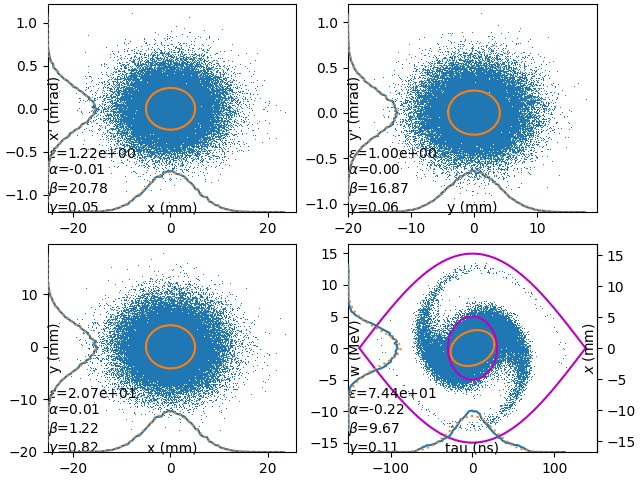
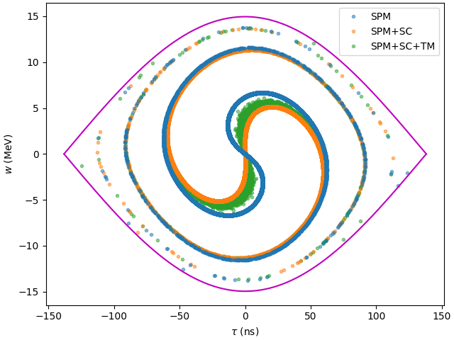
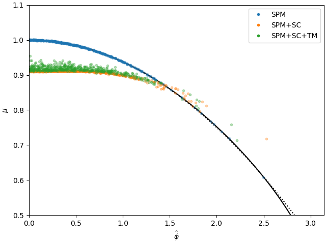

# [sylt](https://alaut.github.io/sylt/)

**SY**nchrotron **L**ongitudinal **T**racker

## Implementation

The __Bunch__, __Ring__, and __Tracker__ objects must be imported.

```python
from sylt.tracking import Bunch, Ring, Tracker
```

To demonstrate __Single Particle Motion__, a basic ring can be instantiated by

```python
ring = Ring(
    R=100,          # machine radius (m)
    h=8,            # rf harmonic
    Vg=80e3,        # gap voltage (V)
    gamma_t=6.1,    # transition
    )
```

A bivariate gaussian bunch can be generated with

```python
bunch = Bunch(
    E=2.938272e9,   # particle energy (eV)
    n=50e3,         # number of macroparticles
    sig_w=4e6,      # rms energy width
    sig_tau=30e-9,  # rms bunch length
    )
```

To incorporate __intensity effects__, a nonzero beam intensity and rms transverse emittance must be defined with respect to the transverse optics and aperture constraints.

```python
bunch.N = 200e12            # number of particles
bunch.sig_eps = 3e-6        # rms transverse emittance (m)

ring.b = (73e-3, 35e-3)     # beam pipe aperture radius (m)
ring.beta = 17              # average beta function
ring.D = (2.66, 0)          # average dispersion function
```

To incorporate the effects of __transverse motion__, individual particle emittance need to be generated by indicating.

```python
bunch.eps = None
```

To track, define a tracker using __Tracker__ and use the __track__ method.

```python
tracker = Tracker(bunch, ring)

for turn in range(10_000):
    tracker.track()
```

At any point, the bunch's phase space distribution can be visualized using __show__. Particle's whose trajectories are knowingly unstable can be marked by using the __clean__ method.

```python
tracker.clean()
tracker.show()
```



By setting ```Tracker.UPDATE = False```, macroparticles can be evaluated as ghost particles wherein the characteristic bunch statistics used to determine induced space charge voltage are held constant. Accordingly, the __tune spread__ of single particle motion (SPM), __tune shift__ of space charge (SC) and __tune blur__ due to effects of transverse motion (TM) can be compared by tracking the evolution of monoenergetic ghost particles.

```python
trackers = {
    'SPM': Tracker(Bunch(E, sig_tau, sig_w, n), ring),
    'SPM+SC': Tracker(Bunch(E, sig_tau, sig_w, n, N, sig_eps), ring),
    'SPM+SC+TM': Tracker(Bunch(E, sig_tau, sig_w, n, N, sig_eps, eps=None), ring)
}

for key, tracker in trackers.items():

    tracker.UPDATE = False

    for turn in range(2_000):
    
        tracker.track()
        tracker.clean()
    
        ax.plot(tracker.bunch.tau, tracker.bunch.w, label=key)
```



The relative time evolution of particles can be assessed by appending time data into an array and then computing an FFT to return a particle's synchrotron frequency as a function of it's maximum oscillation amplitude.

```python
DATA = {}
for i, (key, tracker) in enumerate(trackers.items()):
    tracker.UPDATE = False

    tau = []
    for turn in range(500_000):
        tracker.track()
        tau.append(tracker.bunch.tau)

    tau_hat, f = compute_synchrotron_frequency(np.array(tau), tracker.T)

    DATA[key] = {
        'phi_hat': ring.h*tracker.omega*tau_hat,
        'mu': 2*np.pi*f/tracker.Omega.real,
    }
```

The evolving relative time data can be processed and depicted as a synchrotron frequency spectrum with using __sylt.plotting.plot_tune__.



## References

- A. Laut and A. Lasheen, “[Influence of Transverse Motion on Longitudinal Space Charge in the CERN PS](https://drive.google.com/open?id=1AdkxdEvXXhXO1ewIXUXm31VhAgo93jxw&authuser=alexanderlaut%40gmail.com&usp=drive_fs),” presented at the 64th ICFA Advanced Beam Dynamics Workshop, Fermilab, 2021.

