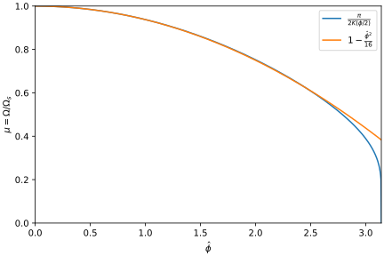

## Equations of Motion

Consider the relative time and energy coordinates

$$\tau = t-t_s\qquad w=W-W_s,$$

where $t$ represents time and $W$ represents particle energy. Subscripted variables indicate the synchronous particle within a synchrotron.

The particle __kick__

$$\Delta W = qV_g\sin\varphi,$$

describes the discrete energy gain of a particle passing through an RF gap of voltage $V_g$ with RF phase $\varphi=h\omega_st$, defined by the harmonic $h$ and angular revolution frequency $\omega_s$.

Averaged across one synchrotron period $T_s$, the instantaneous relative energy gain can be given by

$$\dot{w}=\frac{\Delta w}{T_s} = \frac{qV_g}{T_s}(\sin\varphi-\sin\varphi_s).$$

Using logarithmic derivatives, the relationship between revolution period $T$, path circumference $C$ and relative velocity $\beta$ can be described by

$$\frac{dT}{T} = \frac{dC}{C} - \frac{d\beta}{\beta}.$$

__Momentum compaction__ is defined as follows

$$\alpha \equiv \frac{dC/C}{dp/p} \equiv \frac{dR/R}{dp/p}.$$

Using the relationship

$$\frac{d\beta}{\beta} = \frac{1}{\gamma^2}\frac{dp}{p}$$

if we subsitute for $dC/C$ and $d\beta/\beta$ we get

$$\frac{dT}{T} = \left(\alpha - \frac{1}{\gamma^2}\right)\frac{dp}{p} = \eta\frac{dp}{p},$$

where the __slippage factor__ is defined by

$$\eta =\alpha- \frac{1}{\gamma^2}.$$

From

$$\frac{dp}{p}=\frac{1}{\beta^2}\frac{dE}{E}$$

we have the particle __drift__ described by

$$\frac{dT}{T} = \frac{\eta}{\beta^2}\frac{dE}{E}.$$

Our equations of motion can be succinctly written as

$$\dot{\tau} = \frac{\eta}{\beta_s^2E_s}w \qquad \dot{w} = \frac{qV_g}{T_s}g(\phi).$$

where $g(\phi) = \sin\varphi-\sin\varphi_s$.

## Synchrotron Frequency

Defining the relative phase coordinate

$$\phi = \varphi - \varphi_s=h\omega_s\tau$$

for small amplitude oscillations where $\phi\to0$ we can approximate this function by it's gradient

$$g(\phi\to0) \approx g'(\phi)\phi = h\omega_s\tau\cos\varphi_s$$

Taking the second derivative of $\tau$ and substituting in for $\dot{w}$ yields the following 

$$\ddot{\tau}=\frac{h\omega_s^2\eta}{\beta_s^2E_s}\frac{qV_g}{2\pi}\cos\varphi_s\tau$$

or

$$\ddot{\tau}+\Omega_s^2\tau=0$$

where the __synchronous synchrotron frequency__ is defined by

$$\Omega_s^2=-\frac{h\omega_s^2\eta}{\beta_s^2E_s}\frac{qV_g}{2\pi}\cos\varphi_s.$$

Accordingly for small amplitude oscillations, a particle's whose maximum amplitude in phase-space is defined by $\hat{\tau}$ and $\hat{w}$ will follow elliptical trajectories given by

$$\tau=\hat{\tau}\cos\Omega_st \qquad w = \hat{w} \sin\Omega_st.$$

## Hamiltonion

The equations of motion that satisfy hamilton's equations

$$\dot{\tau} = \frac{\partial H}{\partial w} \qquad \dot{w}=-\frac{\partial H}{\partial \tau}$$

can be derived from the following hamiltonion

$$H=\frac{1}{2}\frac{\eta}{\beta_s^2E_s}w^2-\frac{q}{T_s}\int V(\tau)d\tau.$$

## Synchrotron Frequency Spread

A Hamiltonion can be written as follows

$$H = \frac{1}{2}\frac{\eta}{\beta_s^2E_s} w^2-\frac{qV_g}{2\pi h}G(\phi)$$

where

$$G(\phi) = -(\cos(\phi + \varphi_s) + \phi\sin\varphi_s) + \cos\varphi_sd.$$

Accordingly, a particle's energy trajectory $w(\phi)$ is a function of it's preserved hamiltonion value $H$

$$w = \sqrt{H+\frac{qV_g}{2\pi h}G(\phi)}$$

where $H$ is defined by the particles maximum oscillation amplitudes

$$H = \frac{1}{2}\frac{\eta}{\beta_s^2E_s} \hat{w}^2 = -\frac{qV_g}{2\pi h}G(\hat{\phi}).$$

Therefore

$$w = \sqrt{\frac{qV_g}{2\pi h}(G(\phi)-G(\hat{\phi}))}.$$

From our EOM $\dot{\tau} = \frac{\eta}{\beta_s^2E_s} w$ and that $\phi = h\omega_s\tau$ we can generate the following

$$\dot{\phi} = h\omega_s\frac{\eta}{\beta_s^2E_s}\sqrt{\frac{qV_g}{2\pi h}(G(\phi)-G(\hat{\phi}))}$$

Defining that $W(\phi) = G(\phi)/ \cos\varphi_s$, we can write the following

$$\dot{\phi} = \Omega_s\sqrt{2(W(\phi)-W(\hat{\phi}))}$$

The __normalized synchrotron tune__ $\mu$ can be derived

$$\mu = \frac{2\pi}{\Omega_s}/\oint \frac{d\phi}{\dot{\phi}}=2\pi/\oint \frac{d\phi}{\sqrt{2(W(\phi)-W(\hat{\phi}))}}$$

For the __non-accelerating condition__ where $\varphi_s=0$ and  $W(\phi)=G(\phi) = 1-\cos\phi$, the normalized tune is given analytically by
$$\mu = 2\pi/\oint\frac{d\phi}{\sqrt{2(\cos\hat{\phi}-\cos\phi)}}=\frac{\pi}{2K(\hat{\phi}/2)} \approx 1-\frac{\hat{\phi}^2}{16}+\mathcal{O}(\hat{\phi}^4)$$

Accordingly, we see a parabolic relationship with the synchrotron frequency of particles with non-ideal oscillation amplitudes. We call this __Synchrotron Frequency Spread__.

